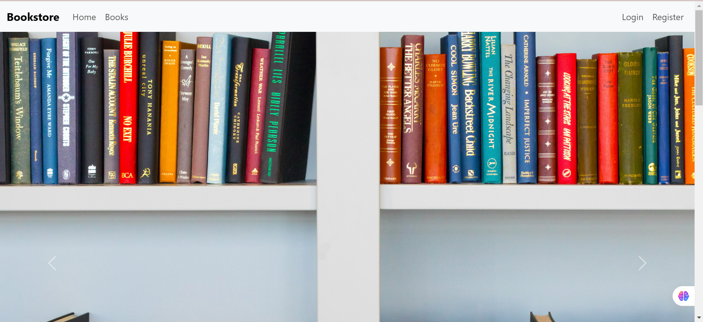
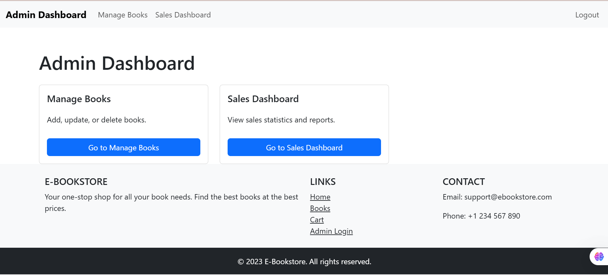
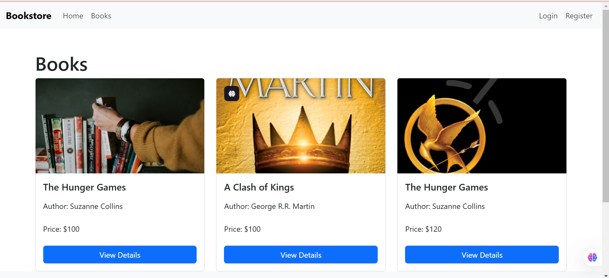
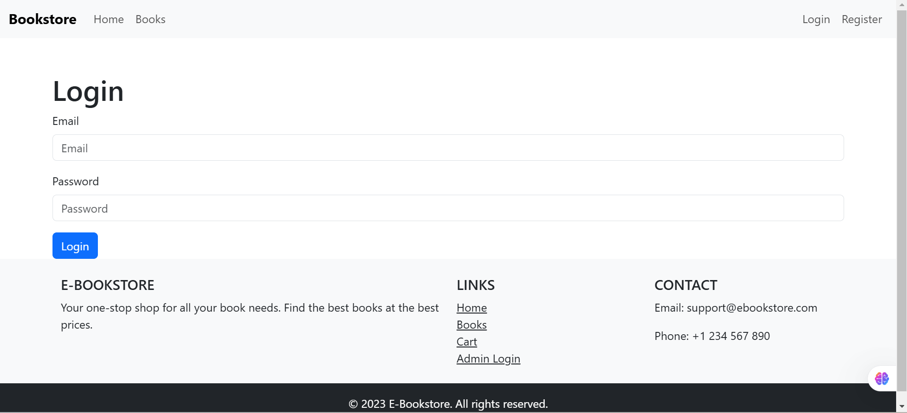
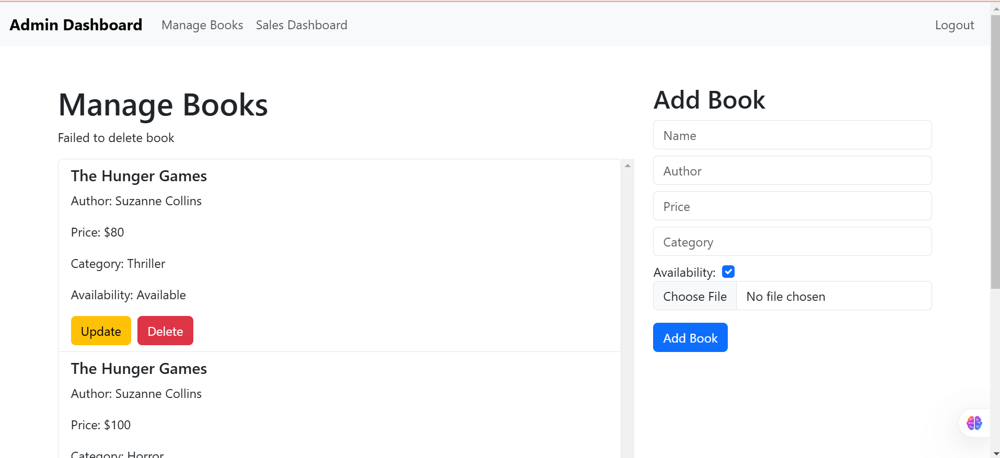
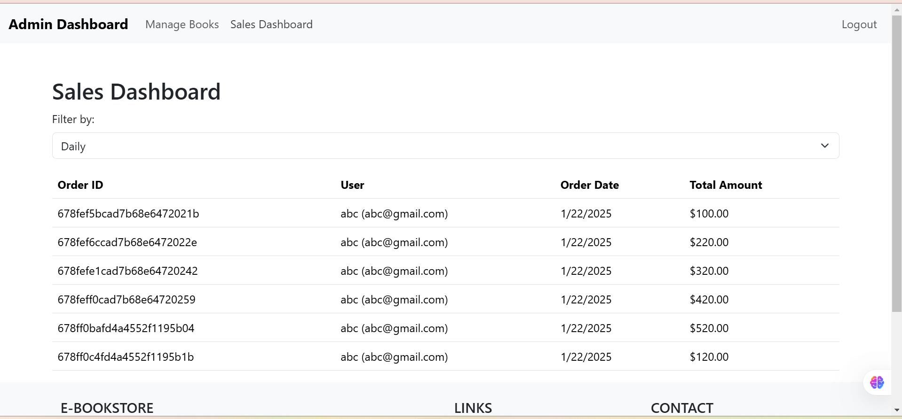

screenshot/template.png
## Project Overview
The E-Bookstore project is a full-stack web application designed to provide users with an online platform to browse, purchase, and manage books. The application includes features for user registration, login, book browsing, cart management, order placement, and an admin dashboard for managing books and viewing sales.

## Screenshots

### Welcome Page


### Admin Dashboard


### Books Page


### Login Page


### Manage Books


### Sales Dashboard



## Technologies Used

### Frontend:
- React.js
- React Router
- Axios
- Bootstrap

### Backend:
- Node.js
- Express.js
- MongoDB
- Mongoose
- bcrypt.js (for password hashing)
- express-session (for session management)
- connect-mongo (for session storage)

## Features

### User Features:
1. **User Registration and Login:**
   - Users can register with their name, email, and password.
   - Users can log in with their email and password.

2. **Book Browsing:**
   - Users can browse a list of books displayed on the home page.
   - Each book displays its title, author, description, price, and image.

3. **Cart Management:**
   - Users can add books to their cart.
   - Users can view their cart and proceed to place an order.

4. **Order Placement:**
   - Users can place an order for the books in their cart.
   - Orders are stored in the database with details such as user ID, items, total amount, and order date.

### Admin Features:
1. **Admin Login:**
   - Admins can log in with their email and password.

2. **Book Management:**
   - Admins can add, update, and delete books.

3. **Sales Dashboard:**
   - Admins can view all orders placed by users.
   - Orders are displayed with details such as order ID, user, order date, and total amount.
   - Admins can filter orders by daily, weekly, and monthly sales.

## Project Structure

### Frontend:
- **Components:**
  - `AdminNavbar.js`: Navigation bar for admin users.
  - `BookList.js`: Displays a list of books.
  - `BookDetails.js`: Displays details of a single book.
  - `Cart.js`: Displays the user's cart and allows order placement.
  - `Footer.js`: Footer component for the application.
  - `SalesDashboard.js`: Displays sales data for admin users.

- **Pages:**
  - `Home.js`: Home page displaying a slider and a list of books.
  - `Login.js`: User login page.
  - `Register.js`: User registration page.
  - `AdminLogin.js`: Admin login page.
  - `AdminDashboard.js`: Admin dashboard page.

### Backend:
- **Models:**
  - `User.js`: User schema and model.
  - `Book.js`: Book schema and model.
  - `Order.js`: Order schema and model.
  - `Admin.js`: Admin schema and model.

- **Controllers:**
  - `userController.js`: Handles user registration, login, and authentication.
  - `bookController.js`: Handles book CRUD operations.
  - `orderController.js`: Handles order placement and fetching.
  - `adminController.js`: Handles admin login and authentication.

- **Routes:**
  - `userRoutes.js`: Routes for user-related operations.
  - `bookRoutes.js`: Routes for book-related operations.
  - `orderRoutes.js`: Routes for order-related operations.
  - `adminRoutes.js`: Routes for admin-related operations.

- **Middleware:**
  - `authMiddleware.js`: Middleware for protecting user routes.
  - `adminMiddleware.js`: Middleware for protecting admin routes.

### Database:
- **MongoDB:**
  - Used for storing user, book, and order data.
  - Mongoose is used for schema definition and interaction with MongoDB.

## Installation and Setup

1. **Clone the repository:**
   ```bash
   git clone https://github.com/dilzaibofficial/Book-Store-With-Admin-dashboard-Mern-Stack.git
   cd E-Bookstore
   ```

2. **Install dependencies:**
   ```bash
   npm install
   cd frontend
   npm install
   ```

3. **Set up environment variables:**
   - Create a `.env` file in the root directory with the following variables:
     ```env
     MONGO_URI=<your-mongodb-uri>
     SESSION_SECRET=<your-session-secret>
     ```

4. **Run the application:**
   ```bash
   npm run dev
   ```

## Conclusion
The E-Bookstore project provides a comprehensive platform for users to browse and purchase books online, while also offering robust admin features for managing books and viewing sales data. The project leverages modern web technologies to deliver a seamless and user-friendly experience.
